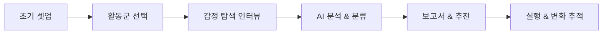

# FindFienU  
Personalized Joy & Immersion Tendency Analysis & Recommendation Service  
________________________________________  

🎯 프로젝트 개요  
사람들은 무엇을 하면 진정으로 즐거운지 잘 알지 못해 즉각적 자극에만 의존하고, 반복되는 경험에 금세 지치며 자기 이해도가 낮습니다.  
FindFienU는 사용자가 기억에 남는 즐거움의 순간을 회상하고 그 이유를 분석해, 자신만의 몰입·즐거움 성향을 발견하도록 돕습니다.  
이를 통해 ‘나다운’ 경험 선택, 지속적인 동기 부여, 의미 있는 행동 연결을 가능하게 합니다.  
________________________________________  

📑 목차  
1. 핵심 가치 & 목표  
2. 주요 기능 및 사용자 흐름  
3. 서비스 아키텍처  
4. 기술 스택 & MVP 우선순위  
5. 로드맵 & 확장 계획  
6. 설치 및 개발 환경  
7. 컨트리뷰션  
8. 라이선스  
________________________________________  

## 핵심 가치 & 목표  
- **자기 이해 증진**  
  기억에 남는 순간을 되짚어보고, 그때 느낀 감정·상황·동기를 분석하도록 유도합니다.  
- **맞춤형 성향 분석**  
  자기결정성 이론(SDT)의 3대 욕구(자율성·유능감·관계성) 기반 대분류와, 행동 방식 12유형 소분류로  
  사용자에게 ’내 즐거움 유형 카드’를 제공합니다.  
- **실행 가능한 추천**  
  분석 결과를 바탕으로 콘텐츠·활동·루틴 등 구체적이고 즉시 실행 가능한 제안을 제공합니다.  
________________________________________  

## 주요 기능 및 사용자 흐름  
1. **초기 셋업 (Onboarding)**  
   - 닉네임·나이·성별·직업·주간 자유시간 등 기초 정보 수집  
   - 기존 즐겨 하는 활동 입력 또는 추천 활동군에서 선택  
2. **WHAT 수집: 활동군 & 세부 활동**  
   - 영화·운동·게임·여행·전시·독서 등 활동군 선택  
   - 세부 선택지(예: 러닝·필라테스·수영) 중 경험 여부 선택  
3. **WHEN & WHY 수집: 감정 탐색 챗봇 인터뷰**  
   - “이 활동을 하면서 가장 기억에 남는 순간은 언제였나요?”  
   - “왜 좋았다고 느꼈나요?”, “혼자 vs 함께?” 등의 심층 질문  
   - 1:1 Rule-based 챗봇 흐름으로 행동 기반 12유형 분류  
4. **AI 기반 성향 분석 & 유형화**  
   - 키워드 추출, 룰 기반 라벨링 + NLP 감정·행동 분류  
   - SDT 3대 욕구 및 12유형 점수화 → 대표·보조 유형 도출  
5. **결과 리포트 & 행동 추천**  
   - 나의 몰입/즐거움 유형 카드  
   - 몰입 패턴 요약 (혼자·반복·도전·감정 공유 등)  
   - 콘텐츠·활동·습관 설정 추천  
   - (MVP 이후) 변화 추적 & 시각화  
________________________________________  

________________________________________  
| 단계        | 기간     | 핵심 기술                               | 주요 구현 항목                                                                                  |
|-------------|----------|-----------------------------------------|------------------------------------------------------------------------------------------------|
| **MVP 1**   | 3주 이내 | Typeform/Tally, Voiceflow, Node.js      | - 기초 설문(폼)    - Rule-based 대화 흐름    - SDT 룰 기반 분류    - 정적 결과 카드 생성       |
| **Phase 2** | 1~2달    | Python NLP, BERT/GPT, NoSQL DB          | - LLM 기반 감정·행동 벡터화    - 추천 알고리즘 고도화    - 동적 리포트 & 시각화       |
| **Phase 3** | 장기     | Community, WebSocket, Analytics         | - 커뮤니티 피드백 모듈    - 실시간 챗역량    - A/B 테스트 & 사용자 행동 분석  |
________________________________________  

## 로드맵 & 확장 계획

1. 성향 추적 & 비교 기능
 - 주기적 리피트 설문 결과 시각화
2.커뮤니티 기반 추천
  - 유사 성향 사용자 그룹 추천 활동
3.심화 NLP & 멀티모달 분석
 - 이미지·비디오 컨텍스트 추출
4. 모바일 앱 런칭
 - React Native / Flutter 기반
5. API 공개 & 서드파티 통합
 - 외부 서비스와 연동 가능한 오픈 API
________________________________________  

### 라이선스

SNU Technology and Startup (400.212) © 2025 FindFienU Team
____
